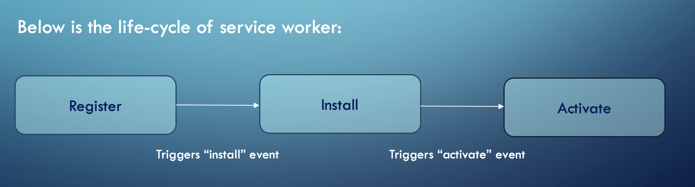
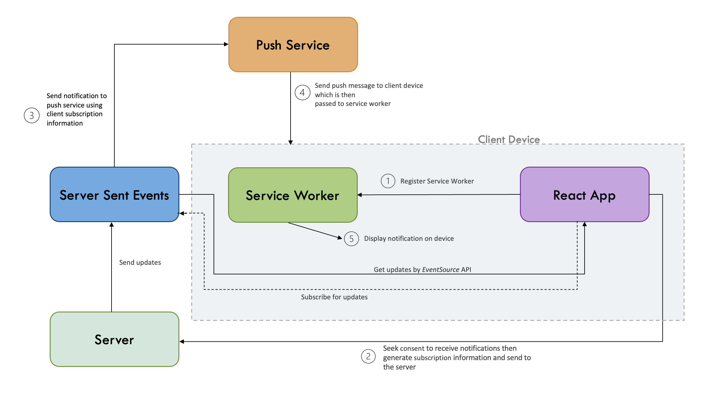

# Progressive Web App (PWA)
## Using Server Side Events and Service Worker

- [Introduction](#introduction)
- [Requirements](#requirements)
- [Installation](#Installation)

---

## Introduction

> What is Progressive Web App(PWA)?

  __Web application + additional power:__
 - Work in offline (without internet)
 - Push notification
 - Caching data
 - Real-time data updates

> What is server sent events?
- Uni-directional communication system
- Keeps connection live until client/server closes it
- Used to push events and messages from server to client

> What is service worker?
- A service worker is a script that runs independently in the browser background
- It acts as Proxy server between web application, browser, and the network
- Runs in the different thread to the main JavaScript




---
## Requirements
- NodeJs
- ReactJs
- ExpressJs
- WebPack
- JavaScript 
- TypeScript

---

*A demo for progressive web application with features like offline, push notifications, etc,*



---

## Installation

#### `Step 1` - clone the repo

```bash
$ git clone https://github.com/Vinaxi07/Progressive-Web-App.git
```

#### `Step 2` - cd in the repo

```bash
$ cd Progressive-Web-App
```

#### `Step 3` - install dependencies

```bash
$ npm install
```

#### `Step 4` - run server

```bash
$ cd server
$ node server.js
```

#### `Step 5` - Open another terminal and run application

```bash
$ cd client
$ npm start
```


<div align="center"> <h2> 🎉 Happy Coding! 🎉 </h2> 
</div>